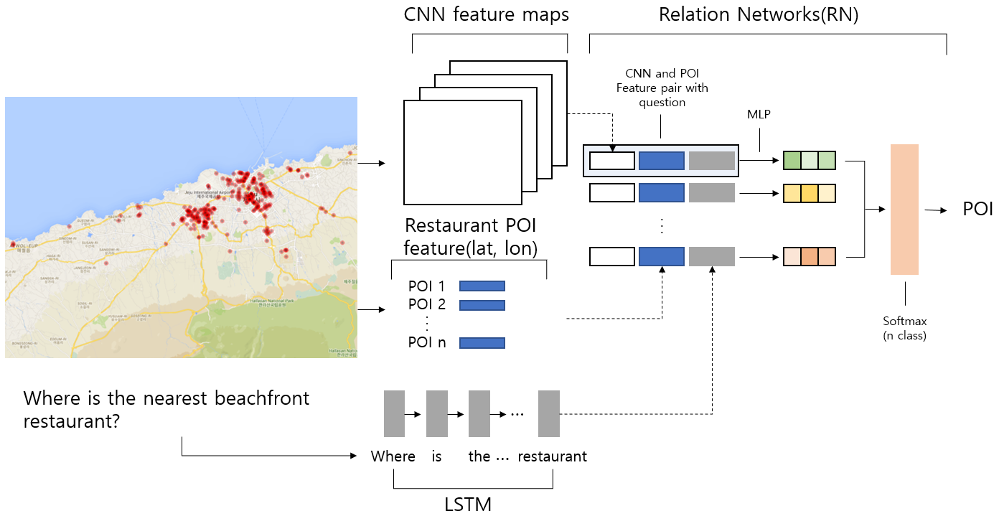
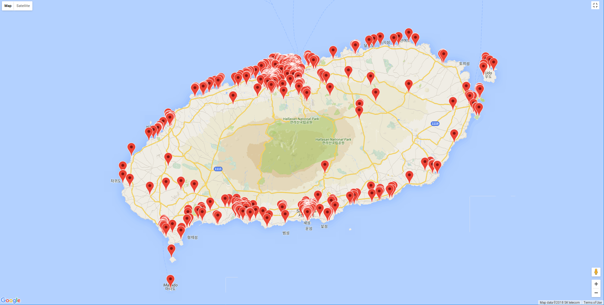

# JEJU-DLCAMP

This repository is about the project during **DEEP LEARNING CAMP JEJU ( 2018. 7. 1 ~ 30 )**

## Motivation of Project

What if, the Model can understand the map ?
  * Near / Far
  * Beach / Land
  
  
What if, the Model can understand question ?
  * Where is the nearest beachfront restaurant?
  * Where is the restaurant with a nearby cafe?
  
 
The model will be able to recommend a suitable place according to our questions.

## First Draft Model

### Model Architecture

    

Our model contains 3 Deep-Learning techniques, which **CNN** for Image processing, **LSTM** for Text(Question) processing and
**RN** for Relational reasoning between two object.   

### Dataset

Jeju Island POI(point-of-interst) [Dataset](https://www.data.go.kr/dataset/15004770/fileData.do)

    

The data contains the following information
* Latitude
* Longitude
* Place type (Restaurant, Cafe, ...)
* Place name
* Place Adress 

### Image

