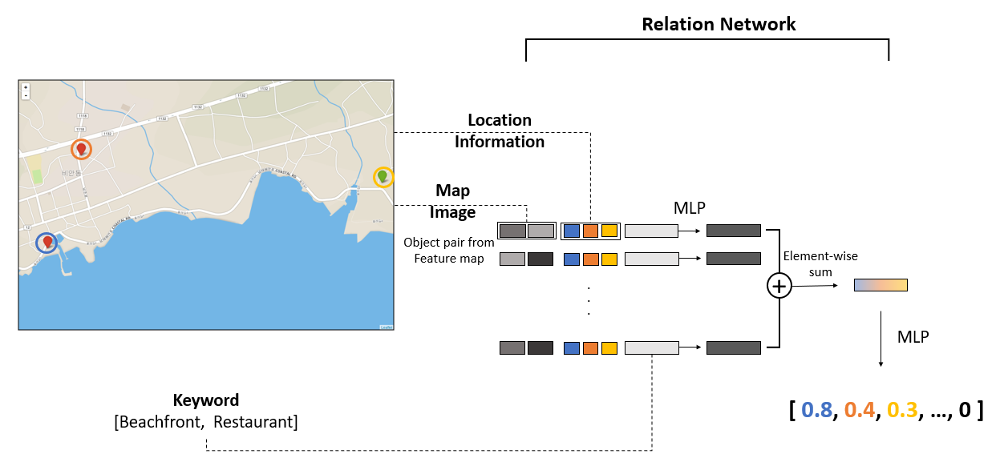
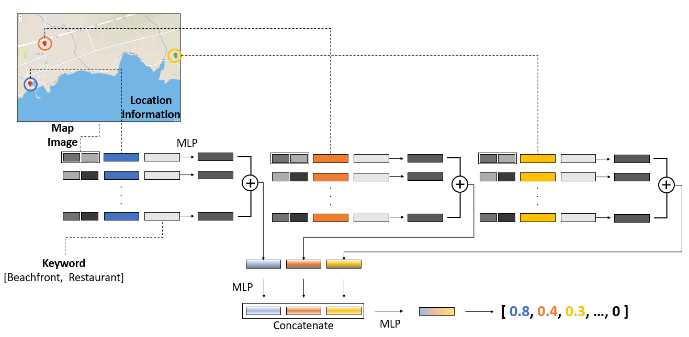
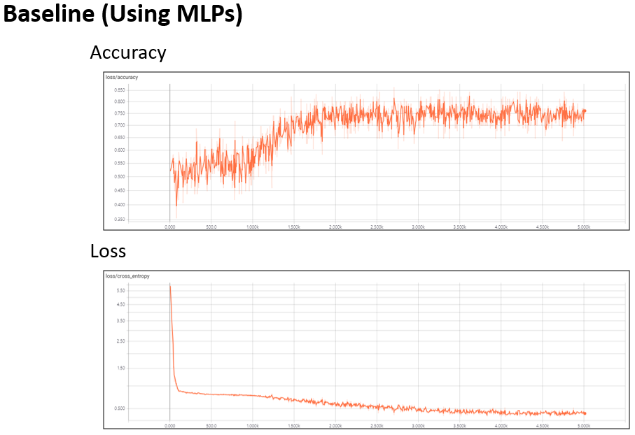
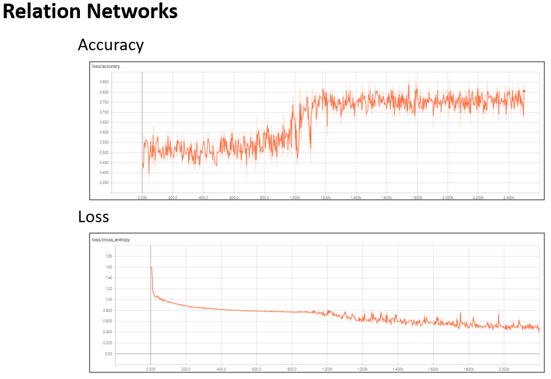
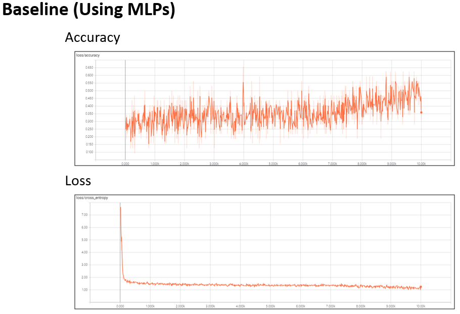
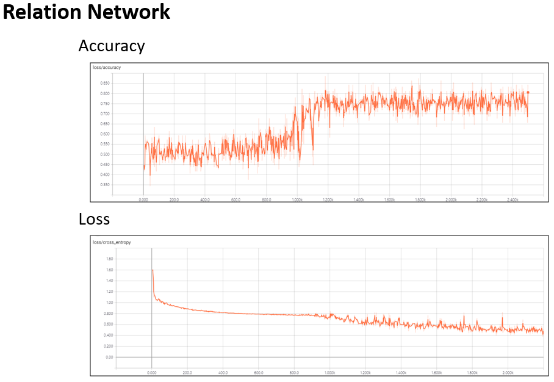
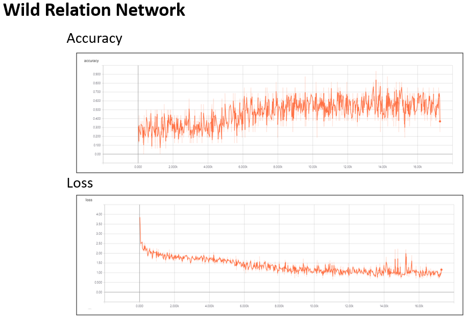

# JEJU-DLCAMP

This repository is about the project during **DEEP LEARNING CAMP JEJU ( 2018. 7. 1 ~ 30 )**

## Motivation of Project

Jeju Island POI(point-of-interst) [Dataset](https://www.data.go.kr/dataset/15004770/fileData.do)

    

Sometime it really hard to find proper place to go.

What if, the Model can understand where do i want to go and understand location of the place in the map ?

The Model will be able to recommend a suitable place according to the **Location** you are currently in and **Keyword** you want to go.
   

## Model Architecture

We using [Relation Networks](http://papers.nips.cc/paper/7082-a-simple-neural-network-module-for-relational-reasoning) basically contains **CNN** for Image processing, and **RN** for Relational reasoning between two object(Image, Text).

    

And also using [Wild Relation Network](http://proceedings.mlr.press/v80/santoro18a.html) for improve the recommendation accuracy.

    

## Dataset

The data contains the following information

* User Location
* Image Location (Center, Boundary)
* Place Information (type [Restaurant, Cafe, ...], Location [Latitude, Longitude])

At the beginning of the project, I decided to only consider the POI for restaurant and cafe in Jeju Island. Each **Image** has a number of POIs which marked with red(restaurant), green(cafe) marker.

Also, the center(user position) **location** of the image, boundary location information and the location information of restaurant and cafe in Jeju Island are required for input.

Among the various **Keyword**, I will focus on the following Keyword first. 
* Restaurant ?
* Cafe ?
* Beachfront ?
* Near ?
* Cafe nearby restaurant ?
* Restaurant nearby cafe ?

The possible **Answer** is a softmax vector whose with probability for POIs

*[probability of POI 1, probability of POI 2, probability of POI 3,...,probability of POI n]*
  

## Experiment

### 2 - Class Dataset

    

At the begining of the Project, to make sure the Relation Network working well for our Project we tried very simple problem that have only 2 class.

### Result (Training)

    

 

    

 

### Result (Testing)

| | RN model | Baseline model |
| --- | --- | --- |
| Accuracy | **82%** | 74% |

   

### 10 - Class Dataset

    

First task of the Project, we take only 10 places that located in the map and recommend the places to the user which are highly related with user's keyword.

### Result (Training)

    

 

    

 

    

 

### Result (Testing)

| | WReN model | RN model | Baseline model |
| --- | --- | --- | --- |
| Top - 1 Accuracy | **33%** | 20% | 0% |
| Top - 3 Accuracy | **76%** | 70% | 70% |

   

## Related works

* [A Simple Neural Network Module for Relational Reasoning](https://arxiv.org/abs/1706.01427) by Santoro, Adam, et al.
* [Measuring Abstract Reasoning in Neural Networks](http://proceedings.mlr.press/v80/santoro18a.html) by Santoro, Adam, et al.
* [Relation-Network-Tensorflow](https://github.com/gitlimlab/Relation-Network-Tensorflow) by Shao-Hua Sun

## Acknowledge

This was supported by [Deep Learning Camp Jeju 2018](http://jeju.dlcamp.org/2018/) which was organized by [TensorFlow Korea User Group](https://facebook.com/groups/TensorFlowKR/).
Thank you to my mentor [SOURABH BAJAJ](https://sourabhbajaj.com/) who gave me the best mentoring and thank you everyone, that I met during the camp.

## Author

Sein Jang

## License

© [Sein Jang], 2018. Licensed under the [MIT](LICENSE) License.
