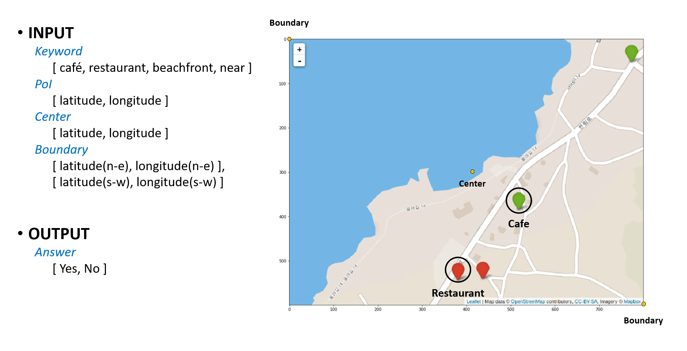
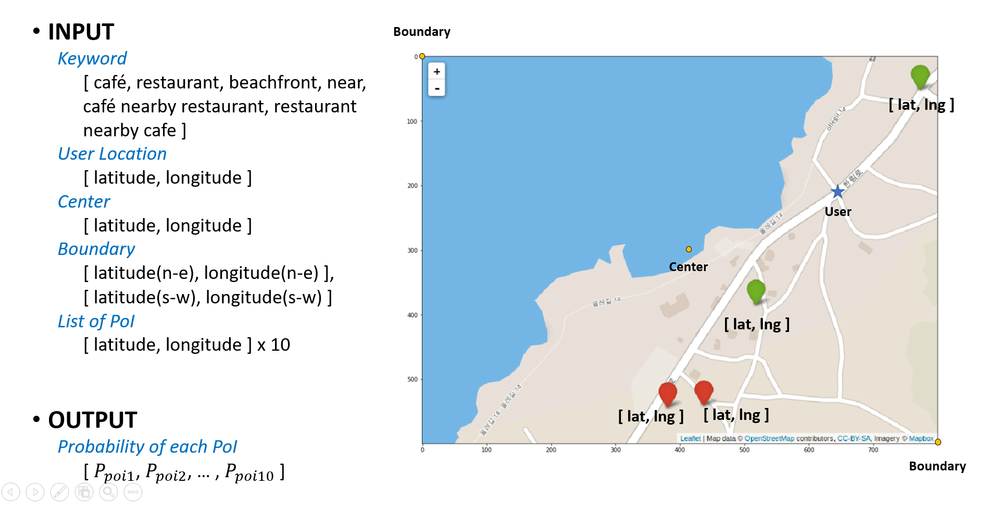

# JEJU-DLCAMP

This repository is about the project during **DEEP LEARNING CAMP JEJU ( 2018. 7. 1 ~ 30 )**

## Motivation of Project

Jeju Island POI(point-of-interst) [Dataset](https://www.data.go.kr/dataset/15004770/fileData.do)

    

Sometime it really hard to find proper place to go.

What if, the Recommendation Model can understand where do i want to go and understand location of the place in the map ?

 
The model will be able to recommend a suitable place according to the **CNN** you are currently in and **CNN** you want to go.

### Model Architecture

    

We using Relation Networks Model basically contains **CNN** for Image processing, and **RN** for Relational reasoning between two object(Image, Test).   

### Dataset
# 2 - Class Dataset

    

# 10 - Class Dataset

    

The data contains the following information
* Latitude
* Longitude
* Place type (Restaurant, Cafe, ...)
* Place name
* Place Adress  

At the beginning of the project, I decided to only consider the POI for restaurant and cafe in Jeju Island. Each **Image** has a number of POIs which marked with red(restaurant), green(cafe) marker.

Also, the center(user position) **location** of the image, boundary location information and the location information of restaurant and cafe in Jeju Island are required for input.

Among the various **Keyword**, I will focus on the following Keyword first. 
* Restaurant ?
* Cafe ?
* Beachfront ?
* Near ?
* Cafe nearby restaurant ?
* Restaurant nearby cafe ?

The possible answer is a softmax vector whose with probability for POIs

*[probability of POI 1, probability of POI 2, probability of POI 3,...,probability of POI n]*
